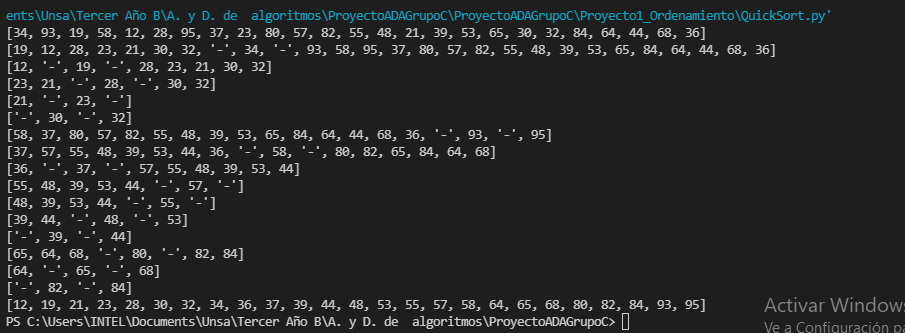
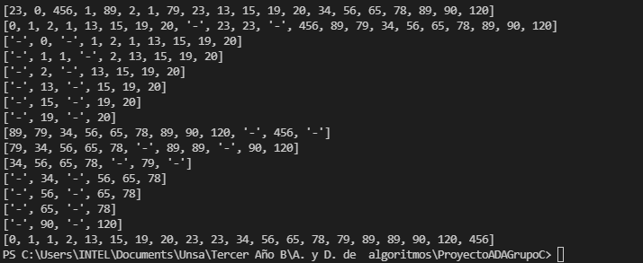

# Metodo QuickSort
La funcion divide los elementos del arreglo en dos subarreglos de menores y mayores con respecto a un pivote
los elementos inferiores al pivote los situaremos en una sublista que hemos denominado Izquierda, y los elementos superiores al pivote los situaremos una sublista denominada Derecha para luego reconstruir la lista concatenando la lista de la izquierda,con el pivote que llamaremos centro, y con la lista de la derecha. Esto para cada una de las sublistas se repite este proceso de forma recursiva, hasta que la sublista más profunda únicamente tiene un elemento.

El archivo se ejecuta haciendo uso de la sonsola y ejecutando el archivo donde esta el codigo.

Captura de los casos de prueba

La funcion presenta una complejidad de O(n).

# Metodo HeapSort
Heapsort es una técnica de clasificación basada en comparación basada en una estructura de datos de montón binario. Es similar al ordenamiento por selección donde primero encontramos el elemento máximo y colocamos el elemento máximo al final. Repetimos el mismo proceso para el elemento restante.

El archivo se ejecuta haciendo uso de la sonsola y ejecutando el archivo donde esta el codigo.

# Metodo InsertionSort
En la funcion recorremos nuestro set de datos posición por posición y comparamos el número con los valores anteriores, en caso de ser menor, lo colocamos en su posición indicada para ordenar de menor a mayor.

El archivo se ejecuta haciendo uso de la sonsola y ejecutando el archivo donde esta el codigo.

