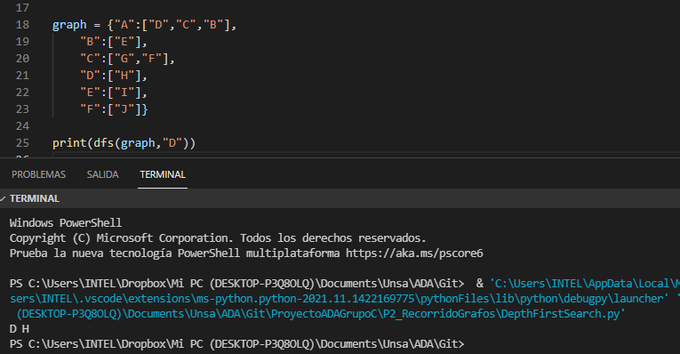

# Funcion DFS

La funcion toma como parametros un diccionario y un caracter dentro del diccionario como nodo origen
o nodo del cual se comenzara la busqueda, realiza la comprobacion de los elementos comenzando por el elemto origen dado añadiendolos a un arreglo y finalmente retornar la lista con elemntos espaciados de la busqueda en profundidad.

Antes de ejecutar el archivo se debe instalar opencv con el sigueinte codigo:

pip install opencv-contrib-python

La funcion se ejecuta haciendo uso de la sonsola y ejecutando el archivo donde esta el codigo.

Captura del caso de prueba:

La funcion presenta una complejidad de:

O(n^2), cuadratica

# Funcion BFS

La funcion toma como parametros un diccionario y un caracter dentro del diccionario como nodo origen
o nodo del cual se comenzara la busqueda, realiza la comprobacion y agregacion del caracter origen para luego comprobar los demas elementos del diccionario e imprimiendo los elementos de la busqueda primera por anchura.

Antes de ejecutar el archivo se debe instalar opencv con el sigueinte codigo:

pip install opencv-contrib-python

La funcion se ejecuta haciendo uso de la sonsola y ejecutando el archivo donde esta el codigo.

Captura del caso de prueba:

La funcion presenta una complejidad de:

O(n^2), cuadratica

# Main

Captura del caso la imagen en escala de grises:

Por problemas con el opencv no ejecuta el mostrar la imagen por eso se comento el codigo la captura de imagen.